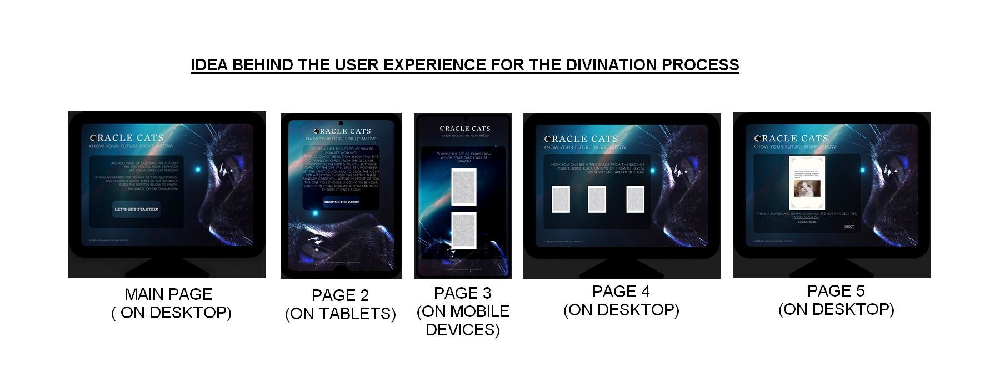

<h1>Welcome to Oracle Cats!</h1>

This website has been created for the recreational purposes as one of the portfolio projects for Code Institute.
The idea behind it combines simple Oracle Cards inspired future- telling game, that is using cat memes as cards and is powered by JavaScript.

- ## User Experience:

    - ### User Stories:

        - #### First Time Visitor Goals:

            1. As a First Time Visitor I want to know the purpose of the website.
            2. As a First Time Visitor I want to easily navigate through the website to find the content I'm interested with.
            3. As a First Time Visitor I want the website content to be interactive.

           - #### Returning Visitor Goals:

            1. As a Returning Visitor I want to be exposed to funny cat memes.
            2. As a Returning Visitor I want to have opportunity to able to have the opportunity to pick an oracle Card Of The Day by myself.
            3. As a Returning Visitor I want to know that my Card Of The Day is special and as so it cannot be drawn more than once a day.
            4. As a Frequent Visitor I want to be able to enjoy using the website on a various screen sizes thanks to a responsive layout.
           

           - #### Frequent Visitor Goals:

            1. As a Frequent Visitor I want to see that the set of cards is being updated and expanded.
            2. As a Frequent Visitor I want to be to see the update notes from the creator.
            3. As a Frequent Visitor I want to get to know more about the creator and their future projects.     
            4. As a Returning Visitor I want to be able to find out more about other forms of divination thanks to the links provided.

 - ## Website functionality:

   - ### Main page:
        
        1. Includes the headings, main content section and footer with copyrights information.
        2. This is a base page for the whole website and it's main content is edited with help of javascript functions.
        3. After clicking the button the html content of the main section changes to the page 2.
            
   - ### Page 2:

        1. The text content inside the main section introduces the User to their next steps in the process of divination.
        2. User is informed, that the card of the day can be only drawn once a day.
        3. After clicking the button the html content of the main section changes to the page 3.

   - ### Page 3:

        1. The text content inside the main section encourages the User to pick one of 2 sets of cards.
        2. Each set includes different groups of cards.
        3. After choosing the card set the content of the main section changes to the page 4.

   - ### Page 4:

        1. The text content inside the main section presents 3 cards for the user to choose.
        2. Each card has been previously randomised based on User's previous choice.
        3. After choosing their Card Of The Day the content of the main section changes to the page 5.

   - ### Page 5:

        1. The text content inside the main section presents the User's Card Of The Day with it's short description.
        2. The additional advice on the special areas of focus is being generated underneath it.
        3. After clicking NEXT on the bottom the User moves to the Page 6 that includes afterword with buttons leading to additional informations 
        about creator and links to other forms of divinations. This is not a part of a divination process and it's optional for the user.

  - ## Design:

       - #### Colour Scheme: 
        
            1. Main colours used for the text and buttons are the shades of blue and white as they work well with the background and provide a good contrast.
            2. Dominating colours in the background picture are the shades of blue, brown and white.
            
       - #### Typography:
        
            1. Inknut Antiqua and Julius Sans One have been chosen as the headings and body fonts as they've been used in the logo and they as they are simple but not too minimalistic and provide aesthetically pleasing experience for a User.            
            2. Fallback fonts used in case of the main fonts not being imported into the site:
                - Arial, sans-serif as a fallback for Julius Sans One,
                - Impact, serif as a fallback for Inknut Antiqua.
            
       - #### Imagery:
        
            1. Imagery in this project plays essensial role. The background picture of a cat intensively staring into Space sets the initial mood for the User. The logo includes the cat's head and indicates the website's strong correlation with cats. Thanks to that Users from their very first moments are introduced to the idea behind the site not only by the direct text content, but also through visuals.
        
  - ## Languages Used:

    - [HTML5] (https://en.wikipedia.org/wiki/HTML5)
    - [CSS3] (https://en.wikipedia.org/wiki/CSS)
    - [JavaScript] (https://en.wikipedia.org/wiki/JavaScript)

